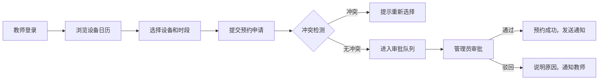

## 1. 产品概述

校园实验室设备运维管理系统，面向高校实验中心，实现显微镜、离心机、通风柜及大型仪器的全生命周期管理。系统支持教师预约使用、管理员全流程运维，提升设备利用率与管理效率。

- 目标用户：实验中心管理员、教师/研究人员
- 核心价值：设备台账数字化、预约流程规范化、运维管理智能化

## 2. 核心功能

### 2.1 用户角色

| 角色 | 注册方式 | 核心权限 |
|------|----------|----------|
| 管理员 | 系统创建 | 设备台账管理、预约审批、维修派单、安全巡检、统计报表、人员权限 |
| 教师 | 注册审核 | 设备预约、使用登记、故障上报、查看培训记录 |

### 2.2 功能模块

1. **仪器总览**：设备台账、状态监控、搜索筛选
2. **预约日历**：日历视图预约、开放时段设置、冲突检测
3. **审批台**：待办审批、预约审核、使用登记
4. **维修工单**：故障上报、维修派单、工单跟踪、耗材绑定
5. **安全巡检**：安全检查、校准提醒、培训准入、违规记录
6. **统计分析**：设备利用率、共享计费、导出报表
7. **人员权限**：用户管理、角色配置、通知公告

### 2.3 页面详情

| 页面名称 | 模块名称 | 功能描述 |
|----------|----------|----------|
| 仪器总览 | 设备卡片 | 展示设备基本信息、运行状态、位置、所属实验室 |
| 仪器总览 | 搜索筛选 | 按设备类型、状态、实验室分类筛选 |
| 仪器总览 | 状态统计 | 设备总数、在线数、故障数、使用率概览 |
| 预约日历 | 日历视图 | 月/周/日视图展示预约情况 |
| 预约日历 | 预约操作 | 选择设备、时段提交预约申请 |
| 预约日历 | 冲突检测 | 自动检测预约时段冲突并提示 |
| 审批台 | 待办列表 | 展示待审批预约申请 |
| 审批台 | 审批操作 | 通过/驳回预约，填写审批意见 |
| 审批台 | 使用登记 | 记录实际使用时长、设备状态 |
| 维修工单 | 故障上报 | 填写故障描述，上传照片 |
| 维修工单 | 维修派单 | 指派维修人员，设置优先级 |
| 维修工单 | 工单状态 | 跟踪维修进度，记录处理结果 |
| 维修工单 | 耗材绑定 | 关联维修使用的耗材 |
| 安全巡检 | 检查计划 | 制定安全检查计划，分配检查任务 |
| 安全巡检 | 检查记录 | 记录检查结果，发现隐患 |
| 安全巡检 | 校准提醒 | 设备校准周期提醒 |
| 安全巡检 | 培训准入 | 设备使用培训记录，准入控制 |
| 安全巡检 | 违规记录 | 记录违规使用情况 |
| 统计分析 | 利用率统计 | 按设备、实验室维度统计使用率 |
| 统计分析 | 计费统计 | 共享计费明细统计 |
| 统计分析 | 报表导出 | 支持 Excel/PDF 格式导出 |
| 人员权限 | 用户管理 | 用户信息管理，账号启用/禁用 |
| 人员权限 | 角色配置 | 角色权限分配 |
| 人员权限 | 通知公告 | 发布系统通知和公告 |

## 3. 核心流程

### 3.1 预约使用流程

### 3.2 故障维修流程

## 4. 用户界面设计

### 4.1 设计风格

- **主色调**：科技蓝 (#165DFF)，体现专业、稳重
- **辅助色**：成功绿 (#00B42A)、警告黄 (#FF7D00)、危险红 (#F53F3F)
- **中性色**：深灰 (#1D2129)、中灰 (#4E5969)、浅灰 (#C9CDD4)、背景 (#F2F3F5)
- **按钮风格**：圆角 6px，主按钮蓝色填充，次按钮边框样式
- **字体**：PingFang SC / Microsoft YaHei，标题 16-20px，正文 14px
- **布局风格**：左侧导航 + 顶部栏 + 内容区，卡片式布局
- **图标风格**：Lucide 线性图标，统一 20px 尺寸

### 4.2 页面设计概览

| 页面名称 | 模块名称 | UI 元素 |
|----------|----------|---------|
| 仪器总览 | 顶部统计 | 数据卡片展示设备总数、在线率、故障数、利用率 |
| 仪器总览 | 设备列表 | 网格布局卡片，展示设备图片、名称、编号、状态标签 |
| 仪器总览 | 筛选栏 | 类型筛选、状态筛选、搜索框 |
| 预约日历 | 日历视图 | 完整日历组件，不同颜色区分预约状态 |
| 预约日历 | 侧边栏 | 设备选择器，预约表单 |
| 审批台 | 数据表格 | 待审批列表，操作按钮列 |
| 审批台 | 详情弹窗 | 展示预约详情，审批操作区 |
| 维修工单 | 看板视图 | 按状态分列展示工单卡片，支持拖拽 |
| 维修工单 | 详情页 | 工单信息、处理记录、耗材清单 |
| 安全巡检 | 统计卡片 | 检查完成率、隐患数、待校准设备 |
| 安全巡检 | 检查清单 | 检查项列表，勾选确认 |
| 统计分析 | 图表区 | ECharts 柱状图、折线图展示数据趋势 |
| 统计分析 | 数据表格 | 明细数据，支持导出 |
| 人员权限 | 用户列表 | 表格展示用户信息，角色标签 |
| 人员权限 | 权限配置 | 树形权限选择器 |

### 4.3 响应式

- 桌面端优先设计，最小支持 1280px 宽度
- 平板端适配：左侧导航可折叠
- 移动端适配：顶部汉堡菜单，单列布局

### 4.4 动效设计

- 页面切换：淡入淡出过渡 200ms
- 卡片悬停：阴影加深，轻微上移 4px
- 按钮交互：背景色渐变过渡 150ms
- 数据加载：骨架屏脉冲动画
- 状态变化：数字滚动动画
