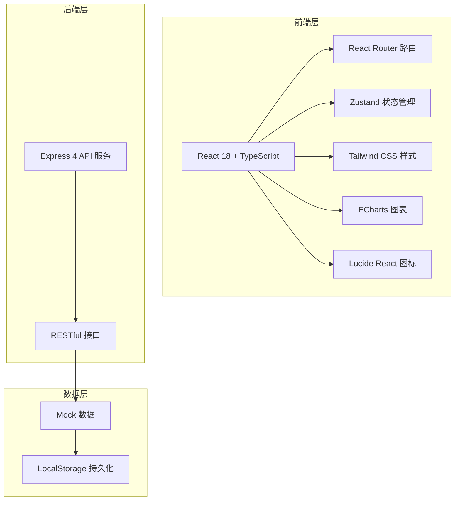
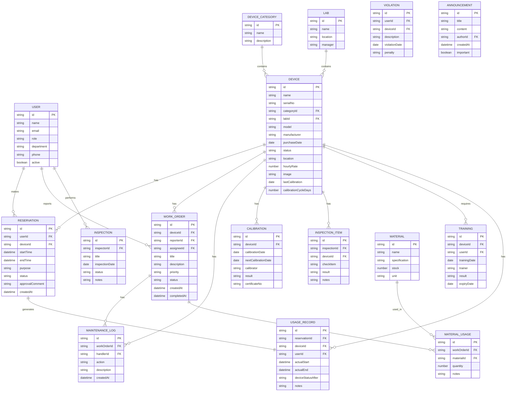

## 1. 架构设计



## 2. 技术描述

- **前端**：React@18 + TypeScript + React Router DOM + TailwindCSS@3 + Zustand + ECharts + Lucide React
- **初始化工具**：vite-init
- **后端**：Express@4（可选，初期使用 Mock 数据）
- **数据存储**：LocalStorage + Mock 数据，支持后续对接真实后端
- **UI 组件**：自定义组件库，基于 Tailwind CSS 构建

## 3. 路由定义

| 路由 | 页面 | 说明 |
|------|------|------|
| /dashboard | 仪器总览 | 设备台账与状态总览 |
| /calendar | 预约日历 | 日历视图预约管理 |
| /approval | 审批台 | 预约审批与使用登记 |
| /maintenance | 维修工单 | 故障维修工单管理 |
| /safety | 安全巡检 | 安全检查与培训管理 |
| /statistics | 统计分析 | 数据统计与报表导出 |
| /users | 人员权限 | 用户与权限管理 |

## 4. 数据模型

### 4.1 数据模型定义



### 4.2 核心类型定义

```typescript
// 用户类型
interface User {
  id: string;
  name: string;
  email: string;
  role: 'admin' | 'teacher';
  department: string;
  phone: string;
  active: boolean;
  avatar?: string;
}

// 设备类型
interface Device {
  id: string;
  name: string;
  serialNo: string;
  categoryId: string;
  labId: string;
  model: string;
  manufacturer: string;
  purchaseDate: string;
  status: 'available' | 'in_use' | 'maintenance' | 'faulty' | 'calibrating';
  location: string;
  hourlyRate: number;
  image?: string;
  lastCalibration?: string;
  calibrationCycleDays?: number;
}

// 预约类型
interface Reservation {
  id: string;
  userId: string;
  deviceId: string;
  startTime: string;
  endTime: string;
  purpose: string;
  status: 'pending' | 'approved' | 'rejected' | 'cancelled' | 'completed';
  approvalComment?: string;
  createdAt: string;
}

// 工单类型
interface WorkOrder {
  id: string;
  deviceId: string;
  reporterId: string;
  assigneeId?: string;
  title: string;
  description: string;
  priority: 'low' | 'medium' | 'high' | 'urgent';
  status: 'pending' | 'assigned' | 'processing' | 'completed' | 'closed';
  createdAt: string;
  completedAt?: string;
}

// 统计数据类型
interface Statistics {
  totalDevices: number;
  availableDevices: number;
  faultyDevices: number;
  maintenanceDevices: number;
  utilizationRate: number;
  monthlyReservations: number[];
  categoryDistribution: { name: string; value: number }[];
  labUtilization: { lab: string; rate: number }[];
}
```

## 5. 项目目录结构

```
src/
├── components/          # 公共组件
│   ├── Layout/         # 布局组件
│   ├── Card/           # 卡片组件
│   ├── Table/          # 表格组件
│   ├── Modal/          # 弹窗组件
│   ├── Calendar/       # 日历组件
│   └── Chart/          # 图表组件
├── pages/              # 页面组件
│   ├── Dashboard/      # 仪器总览
│   ├── Calendar/       # 预约日历
│   ├── Approval/       # 审批台
│   ├── Maintenance/    # 维修工单
│   ├── Safety/         # 安全巡检
│   ├── Statistics/     # 统计分析
│   └── Users/          # 人员权限
├── store/              # Zustand 状态管理
│   ├── useUserStore.ts
│   ├── useDeviceStore.ts
│   ├── useReservationStore.ts
│   └── useWorkOrderStore.ts
├── data/               # Mock 数据
│   ├── users.ts
│   ├── devices.ts
│   ├── reservations.ts
│   └── workOrders.ts
├── utils/              # 工具函数
│   ├── date.ts
│   ├── format.ts
│   └── storage.ts
├── types/              # TypeScript 类型定义
│   └── index.ts
├── App.tsx
├── main.tsx
└── index.css
```
